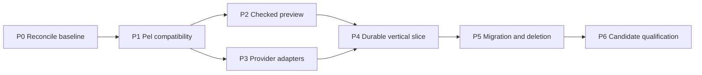

# Return of the ForeDi research plan

The [six feature OpenSpecs](../../releases/return-of-the-foredi/README.md) refine this research sequence into implementable milestones. Use their EARS catalog and test plan for release implementation.

Status: proposed release sequence, 2026-09-12. This document authorizes no runtime dispatch or publication.
The user selected adoption and extension of Pel to simplify Foreman.
Read the [release design](../specs/2026-09-12-pel-release-design.md) first.

**Goal:** Replace Foreman's distributed orchestration instructions and control loops with one Pel execution path and shared provider adapters.

**Architecture:** Implement the published Pel language in TypeScript with explicit compatibility corrections.
Add a Foreman effect library and four provider adapters with six exact model profiles.
Reuse the existing execution ledger, event journal, launcher, and policy boundaries while removing duplicate orchestration owners.

**Technology:** Node.js 24, strict TypeScript, Effect, and the existing Foreman build and verification tools.

## Global constraints

- Adopt Pel rather than create another language.
- Use TypeScript for new executable repository code.
- Use Effect for resource lifetimes, cancellation, retries, timeouts, and concurrency.
- Preserve exact model identities and provider-specific capabilities.
- Give each run one control-flow owner and one authoritative event history.
- Keep capability grants and host verification outside model-generated authority.
- Preserve original source captures and historical execution evidence.
- Count deletion and operational simplification as release requirements.

This is a release-level plan. Each gate produces a bounded implementation brief with exact interfaces and executable fixtures before its code work starts.
Do not turn the entire release into one undifferentiated implementation task.

## Dependencies

P2 and P3 can proceed independently once P1 freezes the shared contracts.
P4 admits only transports with the capabilities its selected workflow needs.
P6 requires evidence for every capability advertised in the release support matrix.

## P0: Reconcile the baseline and freeze the simplification cohort

**Inputs:** Baseline `441c3fb9f6ac`, the source inventory, active v0.5 package records, and the prior workflow-weight measurements.

**Files to inspect:**

- `openspec/changes/v050-release-program/`
- `openspec/changes/lane-runtime-typescript/`
- `openspec/changes/workflow-weight-reduction/`
- `docs/research/pel-release/SOURCE-INVENTORY.json`
- `docs/research/pel-release/ARCHITECTURE-AND-DELETION-MAP.md`

**Deliverable:** One reviewed release ownership table and one baseline measurement record.
Classify each active obligation as retained, replaced by a named Pel gate, or deferred.
Keep its existing authority and evidence references.
Select the release number only after that reconciliation.

Freeze a replacement cohort covering dispatch assembly, workflow loops, retry ownership, recovery orchestration, and duplicated model transport logic.
Record production lines, active entry points, control-flow owners, manual commands, required instruction tokens, and elapsed idle time.
Separate historical measurements from fresh measurements.

**Acceptance:** Every migrated obligation has one owner. No active run changes controller. The measured cohort is reproducible from pinned paths and hashes.

## P1: Freeze the Pel compatibility profile

**Create:** `docs/reference/pel/compatibility.md`, `docs/reference/pel/extensions.md`, and fixture data under `packages/pel/test/fixtures/`.
**Source:** `docs/research/pel-release/PAPER-AND-COMPATIBILITY.md` and the pinned paper capture.

The profile must cover:

- Lexing, escapes, keywords, pairs, quoting, and standalone caret injection.
- Calls versus evaluated literal lists, one-based indexing, slices, key lookup, and nil handling.
- Lexical closures, fixed argument specifications, defaults, partial application, and rejection of mixed argument modes.
- Non-strict `if`, `case`, `for`, `do`, and `do/async` behavior.
- Top-level dependency evaluation and the extension that accounts for effect conflicts.
- Natural-language predicates as recorded model effects.
- Restart choices and the boundary between pure expression replacement and effectful plan revision.

Resolve each contradiction with a paper locator, chosen behavior, rationale, and positive/negative fixture.
For example, the selected one-based profile must reject index zero and document conflicting paper examples.
An unselected branch containing an effect must produce no dispatch or reservation.
Repeated caret insertion must reuse the evaluated pipe input rather than repeat an external effect.

**Acceptance:** Every claimed Pel construct has fixtures. Every extension has a named boundary. No upstream compatibility claim depends on an unverified repository.

## P2: Build checked parsing, evaluation, and previews

**Create:** `packages/pel/src/{tokenizer,parser,values,evaluator,diagnostics,profile}.ts` and corresponding TypeScript tests.
**Modify:** Workspace build configuration and `packages/orchestration/` command wiring when the language package becomes usable.

The language package consumes source bytes and a versioned capability environment.
It returns values or structured diagnostics with source locations.
During admitted execution, host calls suspend evaluation and return recorded results as Pel values.
The preview analyzes those calls without executing them.
The host emits a preview bound to source, language profile, provider profiles, policy requirements, and artifact hashes.

Implement `check` and `plan` before `run`.
Reject malformed programs, unresolved symbols, unsupported profiles, invalid schemas, and unbounded effect policies before admission.
Dynamic values can remain unresolved in a preview only when their future effects remain within an explicit checked envelope.
Use native Pel control flow and pipes. Do not introduce a parallel task-description language.

**Acceptance:** Parsing and preview are deterministic and have no external effects. Tests deny filesystem, subprocess, network, and provider access in these paths.
Changing whitespace can change the source digest but cannot silently change interpreted behavior.
Changing the language or capability profile invalidates an admitted preview binding.

## P3: Build four provider adapters and six exact profiles

**Create:** `packages/providers/src/{contract,profiles,events}.ts` and provider modules under `openai/`, `anthropic/`, `xai/`, and `google/`.
**Inspect for reuse:** Council transport ports, schema lowering, canary encoders, worker adapters, and vendor-preflight contracts.

The shared request contains exact model identity, transport identity, trusted instructions, artifact references, tool policy, output contract, limits, and continuation state.
The shared result contains normalized events, provider identifiers, usage, typed failures, and the observed terminal state.
Keep native-agent sessions separate from direct inference requests.

| Profile | Direct transport plan | Native coding transport plan | Required distinctive fixture |
| --- | --- | --- | --- |
| `grok-4.6` | xAI Responses | Grok Build ACP, with headless fallback explicitly profiled | Reject `max` effort. Do not inherit OpenAI cancellation guarantees. |
| `claude-opus-5` | Messages | Agent SDK or headless Claude Code | Reject disabled thinking at unsupported effort levels. |
| `claude-fable-5-1` | Messages | Agent SDK or headless Claude Code | Reject forced tools and incompatible thinking-state reuse. |
| `gpt-6-astra` | Responses | Codex app server or qualified headless execution | Reject `none` effort. Bind thread identity separately from API response identity. |
| `gpt-5.6-sol` | Responses | Shared Codex transport with a distinct profile | Preserve Sol's effort and price schedule without Astra defaults. |
| `gemini-3.8-flash` | Interactions | Qualified Gemini CLI protocol | Reject `minimal`. Preserve thought state and asynchronous cancellation outcomes. |

Begin with request and event fixtures from official documentation.
Add malformed output, refusal, truncation, denied tool, duplicate event, stream disconnect, timeout, and cancellation cases.
Exercise stdin and file-prompt transport separately because current worker and Council launchers differ.
Run bounded live canaries only after the intended account and exact installed transport are selected.
Use the canaries to establish model identity and advertised capabilities, not to trust a model's self-description.

**Acceptance:** Every profile has explicit supported, unsupported, unknown, and empirically verified fields.
The release matrix claims only tested model/transport combinations.
No fallback changes model identity, permissions, or required behavior silently.

## P4: Execute one durable vertical slice

**Modify:** `packages/orchestration/src/{round-transaction,round-reducer,execution-contract,execution-ledger,resume-decision,resume-queue-execution}.ts` and their tests.
**Reuse:** `packages/event-log/`, `packages/launcher/`, and exact-candidate verification policy.

Select the smallest useful workflow: Grok implementation, host verification, and Sol review.
Run the same control flow with a second verified provider assignment.
Keep the existing queue transport temporarily if needed, but give it no independent workflow policy.

Bind each effect to the source program, runtime profile, attempt, and authority.
Reserve budget before dispatch. Record intent and outcome in the existing journal.
Recover pure evaluation from stable instruction identity and lexical values.
Reuse completed effect receipts. Reconcile uncertain effects before retrying.
Serialize effects with conflicting resource declarations.
Include a negative test where independent symbols both write the same worktree.

Crash fixtures must cover these boundaries:

1. Before budget reservation.
2. After reservation and before dispatch.
3. After dispatch and before receiving a provider identifier.
4. After a tool effect completes and before its receipt is durable.
5. During host verification.
6. During cancellation and cleanup.

The fourth case can require operator reconciliation when external idempotency is unavailable.
An unknown result is not success and is not permission to repeat a destructive effect.

**Acceptance:** One Effect owner controls the run. Recovery preserves budgets and terminal states. A model cannot forge verification or publication evidence.

## P5: Migrate workflows and delete redundant machinery

**Modify or retire:** The exact paths in the architecture deletion map.
Start with one complete legacy orchestration path.
Move its caller to Pel, prove parity, and remove its old control loop in the same bounded change.

Then migrate bounded rework, parallel independent work, race with explicit winner policy, interruption recovery, and Council review orchestration.
Preserve Council's independence, blinding, quorum, and authority checks as policy.
Do not replace those checks with prompts or Pel predicates.

Generate role instructions, CLI help, and previews from the same registered operations and model profiles where practical.
Retire duplicate flag assembly and provider-specific orchestration branches.
Retain historical record decoders after retiring old execution paths.

**Acceptance:** The representative workflow corpus preserves required host outcomes.
The frozen replacement cohort meets the design's net deletion target.
The standard workflow starts with one command and performs one full verification per unchanged candidate/environment binding.
Report total code growth and residual legacy callers alongside the simplification claim.

## P6: Qualify the candidate and installation

Run the repository's required checks on the unchanged candidate, including `npm run verify` and applicable architecture policy checks.
Add compatibility, adapter, crash-recovery, and denied-capability suites from P1–P5.
Run live provider tests separately from deterministic tests and record their exact model/transport identities.

Use a fixed generation evaluation corpus covering sequential work, parallel work, review, retries, refusal, repair, and recovery.
Measure first-attempt admission, bounded repair success, cost, latency, and capability violations for all six profiles.
Keep model-generated plans and failure examples as reviewable artifacts.

Verify the packaged runtime in a clean copied installation.
Check that the Pel examples match that installed version and that legacy interfaces are thin or retired as declared.
Refresh graph qualification separately if the product adopts Graphify 0.9.61.
The research graph cannot satisfy the current qualifier's 0.9.48 pin.

**Acceptance:** Exact candidate evidence satisfies the release design and active publication policy.
Publication remains a separately authorized action through the existing authority mechanism.

## Planning deliverables from this session

- [x] Create an isolated branch from current `origin/main`.
- [x] Read the Pel paper and investigate implementation provenance.
- [x] Capture official documentation and cards for the six requested models with Scrapling.
- [x] Produce the release design, provider evidence, and concrete deletion map.
- [x] Update relevant research and planning tools.
- [x] Create a separate Foreman Obsidian vault and install the verified LLM plugin.
- [x] Complete the combined graph coverage report and vault ingestion verification.

The final checkbox records task state, not implementation readiness.
P0–P6 remain proposed work. No Pel runtime or Foreman provider adapter was implemented in this planning session.
