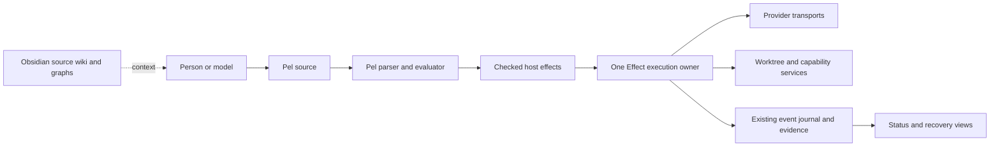

# Foreman Pel release design

Status: proposed release design. The user selected **adopt and extend Pel** on 2026-09-12.
Baseline: `441c3fb9f6ac`, the merge of the v0.5 bootstrap tranche. The remaining v0.5 work is not presumed complete.
Release name: **Foreman Pel**. Assign a version after reconciling the active release program.

## Outcome

Pel becomes the common language for orchestration planning and execution.
A person or model writes one Pel program. Foreman checks it, displays its effects, and executes it through a small host runtime.
The same program describes dependencies, model assignments, verification, review, and recovery.

The release must remove machinery. A Pel front end that leaves every current scheduler, plan format, and manual dispatch step in place does not satisfy this design.

## Decision and alternatives

The user chose Pel adoption over a new Foreman DSL informed by Pel.
Pel's S-expressions, literal lists, closures, named arguments, and pipes are the language foundation.
Foreman-specific operations form a namespaced library. New grammar productions need a demonstrated requirement that library functions cannot meet.

| Approach | Assessment |
| --- | --- |
| Adopt Pel semantics and add a small orchestration library | Selected. Reuses a published language design and makes replacement of existing machinery explicit. |
| Create a separate Foreman language | Rejected by the user. Adds another language to maintain. |
| Translate Pel into the existing manual lane workflow indefinitely | Migration bridge only. Permanent use would preserve most of today's complexity. |

## What adoption means

The research baseline is [Pel, A Programming Language for Orchestrating AI Agents](https://arxiv.org/abs/2505.13453), version 2.
The source review has not verified an official interpreter repository, package release, implementation license, or upstream test suite.
The author's linked homepage describes GitHub availability as forthcoming.

Start with an attributed TypeScript implementation of the published Pel specification.
Do not describe this work as a fork of an unavailable implementation.
If an official implementation becomes available, pin its commit and license before importing code or running differential tests.
Paper access does not establish a license for unpublished interpreter code.

Publish a compatibility profile before writing the interpreter.
Distinguish paper-defined behavior, explicit errata, supported features, and Foreman extensions.
The paper's indexing examples and tokenizer description need resolution through explicit fixtures.
Keep ambiguous behavior out of executable campaigns until the profile resolves it.
See [the paper review](../../research/pel-release/PAPER-AND-COMPATIBILITY.md).

## The smaller architecture



There are three product boundaries:

1. **Pel language.** Parsing, source locations, value semantics, closures, evaluation, diagnostics, and the compatibility suite.
2. **Foreman execution.** Admission, effect execution, resource ownership, durable recovery, verification, and terminal decisions.
3. **Provider adapters.** Exact model profiles and transport implementations for four vendors.

Use existing TypeScript packages for host services that already implement these responsibilities.
Add `packages/pel/` for the language and `packages/providers/` for the provider boundary.
Keep the execution owner in `packages/orchestration/`.
Do not add a second workflow engine, a new authoritative graph store, or a parallel session database for this release.

The canonical authoring artifact is Pel source. Its checked representation is derived and bound to the source hash.
Do not introduce a second editable YAML or JSON workflow language.
Machine-readable previews and execution records are outputs, not competing plans.

## Pel core and Foreman library

Preserve Pel's distinction between calls `(...)` and evaluated literal lists `[...]`.
Preserve `#t`, `#f`, `#nil`, quoted expressions, keywords, lexical closures, partial application, and `^>` piping.
Document fixed arity, named arguments, non-strict built-ins, truth handling, and errors in the compatibility profile.
Resolve caret injection and list indexing with paper-linked fixtures before claiming compatibility.

Model-backed natural-language conditions can advise planning. They cannot decide capability grants, verification results, or publication authority.
Do not expose arbitrary JavaScript, shell evaluation, module loading, or unrestricted network access through the Pel environment.
Untrusted source text is data even when it contains valid Pel.

Proposed library operations are ordinary registered Pel functions:

| Operation family | Responsibility |
| --- | --- |
| `fm/task`, `fm/review` | Execute admitted bounded model work and return schema-validated Pel values. |
| Native `do`, `do/async` | Use Pel's sequencing and concurrency. Enforce host resource limits and effect conflicts. |
| `fm/race` | Evaluate bounded task closures with an explicit winner, cancellation, and cleanup policy. |
| `fm/verify` | Request a host-owned check over an exact candidate and gate selection. |
| `fm/retry` | Describe a bounded retry policy for named retryable failures. |
| `fm/checkpoint` | Name a recovery boundary in the existing journal. |
| `fm/publish` | Request the existing publication transaction with exact candidate evidence and authority. |

The `fm/` function names are a proposed extension API, not claims about upstream Pel.
Only an admitted evaluation can execute a host call.
The evaluator suspends at that call and resumes with its recorded result as a normal Pel value.
Native conditionals, loops, closures, and pipes consume those values directly.
Partial application captures arguments and cannot dispatch work until the function is fully applied during admitted execution.
An unselected conditional branch cannot reserve a budget, create a worktree, or call a provider.

Example of the proposed extension syntax:

```lisp
(fm/task :id "implement" :model "grok-4.6"
  :input "artifact:approved-spec" :output "schema:candidate-v1")
^> (fm/verify :id "verify" :input ^ :gate "candidate-full")
^> (fm/review :id "review" :model "gpt-5.6-sol"
      :input ^ :policy "independent-review")
```

This proposed program does not run today.
Each admitted host call returns a value to the next pipe stage.
The host supplies the workspace, resource limits, tool registry, and authority binding at admission.
An unspecified capability is unavailable. No function can infer permission from a model response.

## Execution semantics

The proposed public commands are `foreman check`, `foreman plan`, `foreman run`, `foreman status`, `foreman resume`, and `foreman cancel`.
These are release targets, not currently available commands.
`check` reports language and capability errors without side effects.
`plan` shows resolved model profiles, dependencies, capabilities, limits, and applicable host gates.
It marks branches and values that depend on future provider results as unresolved.
Conservative capability and budget envelopes bound those regions. Validate each resolved effect before dispatch.
Do not promise a fully materialized static graph for arbitrary Pel programs.
`run` binds that checked program to the existing execution authority before reserving resources.

One Effect scope owns each run. It owns provider requests, subprocesses, worktrees, timers, and cleanup.
Declare resource read and write sets for host effects.
Serialize conflicting writes, including independent expressions that write the same worktree.
Treat unknown resource effects conservatively. Symbol independence alone cannot authorize parallel execution.
Native `do/async` uses these constraints, and `fm/race` requires isolated writable resources for competing tasks.
Persist evaluation checkpoints as versioned data, not serialized JavaScript closures.
Use stable AST locations, lexical value snapshots, and effect identifiers bound to the program and runtime versions.
Pure evaluation can replay. Completed external effects replay their recorded results.

Record an effect intent before dispatch. Record the provider request or session identity when known.
A crash between external completion and receipt persistence produces an unknown outcome.
Reconcile that outcome through the provider or require an explicit recovery decision.
Never claim exactly-once provider execution when a transport cannot provide it.

Model switching starts a new provider session with explicit artifact context.
Opaque thinking state, signatures, and continuation tokens remain with their originating model and transport.
Resuming a terminal run cannot reset its retry, cost, or time budget.
Changing an admitted program requires a new revision bound to the completed prefix and existing authority.

Retries use typed failure categories. Authentication failure, model mismatch, policy denial, and invalid capabilities are not transient retries.
Transport disconnects and rate limits can retry only within a reserved limit.
Cancellation of a local process is distinct from confirmed cancellation of remote model work.
Unknown remote cost remains unknown and consumes the configured conservative reservation.

## Four adapters and six model profiles

One adapter per vendor avoids six copies of orchestration logic.
Profiles preserve model differences instead of normalizing them away.
API and coding CLI transports are distinct implementations of the same host contract.

| Vendor | Exact model profiles | Proposed initial use |
| --- | --- | --- |
| xAI | `grok-4.6` | Routine implementation and bounded tool work. |
| Anthropic | `claude-opus-5`, `claude-fable-5-1` | Opus implementation or review. Fable difficult planning and long tasks. |
| OpenAI | `gpt-6-astra`, `gpt-5.6-sol` | Astra architecture and difficult decisions. Sol implementation and audit. |
| Google | `gemini-3.8-flash` | Fast research, classification, context preparation, and qualified implementation work. |

These assignments are hypotheses for Foreman evaluations, not conclusions from vendor benchmarks.
The auditor's vendor differs from the implementer's vendor when independent review is required.
Opus and Fable share a vendor. Astra and Sol share a vendor.
No profile silently substitutes a different model or changes a requested effort level.

Each adapter provides:

- A capability description tied to documentation hashes and a transport version.
- A read-only readiness probe with separate authentication, model identity, and capability results.
- Request encoding for instructions, artifacts, tools, output contract, and the model's native reasoning controls.
- A streamed event decoder that preserves tool-call IDs, usage, refusals, incomplete output, and opaque continuation state.
- Transport-specific cancellation and resume behavior with explicit unsupported or unknown results.
- Normalized terminal results that never promote a model's completion claim into host verification.

The shared event vocabulary is `started`, `text`, `tool-request`, `usage`, `checkpoint`, `completed`, `refused`, `failed`, and `cancelled`.
Preserve provider events alongside normalized records when they are needed for replay.
Do not place hidden reasoning text in the wiki. Store concise decision rationales and source-backed conclusions.

Pel generation uses the best documented output mechanism for each transport.
Use grammar constraints only where the selected model and endpoint support them.
Otherwise use a structured envelope containing Pel source, followed by local parsing and admission.
A JSON string field does not constrain the Pel grammar inside that string.
Bound repair attempts and report failures before executing any program.

The current Fable documentation rejects forced tool use and requires careful thinking-state preservation.
Gemini 3.8 Flash rejects `minimal` thinking. Astra does not support `none` reasoning.
These differences belong in capability profiles and negative tests.
See the [adapter evidence and source matrix](../../research/pel-release/ADAPTER-EVIDENCE.md) for exact controls and citations.

## Replace machinery in measured stages

First record the current execution trace for a small representative corpus.
Make the Pel bridge produce the same required host effects and terminal decisions.
Then replace the control-flow owner and delete the corresponding old path.
An old and new scheduler must never own the same run.

| Existing responsibility | Proposed disposition |
| --- | --- |
| Repeated lane-role instructions and manually assembled dispatch arguments | Generate bounded model instructions and exact argv from Pel task values and provider profiles. |
| Separate orchestration ordering in scripts, queues, and round instructions | Move ordering into Pel evaluation and one Effect execution owner. |
| Duplicate retry and recovery loops | Replace with journal-backed effect semantics and typed retry policies. |
| Repeated full verification of the same candidate | Reuse host receipts only when candidate, base, checks, tools, dependencies, and environment bindings match. |
| Runtime locks, process containment, credential boundaries, budget authority | Retain the properties and consolidate their interfaces. |
| Execution identity, host evidence, independent review, publication compare-and-set | Retain as host guarantees. Pel requests these operations but cannot manufacture their results. |
| Historical evidence and the existing session store | Preserve. Views can become derived outputs. |
| Graphs, wiki notes, and model suggestions | Advisory planning inputs. They do not grant execution authority. |

The [deletion map](../../research/pel-release/ARCHITECTURE-AND-DELETION-MAP.md) binds these changes to concrete files and migration gates.
Reconcile the existing `lane-runtime-typescript` and `workflow-weight-reduction` packages into this sequence.
Do not finish a redundant scheduler merely because an older plan lists it.
Do not silently replace the active v0.5 release contract during planning.

## Release gates and simplification measures

The implementation plan must pass six independently reviewable gates:

1. **Compatibility:** Paper-linked Pel fixtures, explicit errata, and a frozen extension contract.
2. **Pure execution preview:** Stable parsing, evaluation, effect descriptions, diagnostics, and no side effects in check or plan.
3. **Durable host execution:** One execution owner, identity binding, budget reservation, cancellation, crash reconciliation, and receipt reuse.
4. **Provider conformance:** All six exact profiles pass transport fixtures and bounded live canaries for each claimed capability.
5. **Migration and deletion:** Representative old and Pel workflows preserve required outcomes, and the replaced control path is removed.
6. **Release evidence:** An unchanged candidate passes host checks, independent review, installation checks, and authorized publication checks.

Measure these release targets against a frozen baseline:

| Measure | Proposed release target |
| --- | --- |
| Authoritative orchestration language | One: Pel. |
| Active control-flow owners per run | One. |
| Human commands to start a standard admitted workflow | One `foreman run` command. |
| Orchestration glue lines in the replacement cohort | At least 40% net reduction, including new replacement code. |
| Required cold-start orchestration instructions | At least 50% fewer measured tokens. |
| Full verification executions per unchanged candidate and environment | One reusable host result. |
| Correctly parsed and admitted model-generated programs | At least 95% first attempt and 99% within two repairs on the fixed evaluation set. |
| Capability violations reaching execution | Zero in the hostile test corpus. |

Freeze the replacement cohort before implementation. Keep generated files, tests, and historical archives in separate counts.
Report total production code growth as well as the cohort reduction.
These numbers are acceptance targets. This planning session has not measured the proposed runtime.

## Knowledge workflow and tool state

The local vault is `/home/charl/vaults/Foreman`.
Follow the [Karpathy LLM wiki pattern](https://gist.github.com/karpathy/442a6bf555914893e9891c11519de94f): immutable sources, compiled linked notes, explicit schema, index, and log.
Keep hypotheses, adopted decisions, verified observations, and open questions distinct.
Use source hashes and freshness dates for model capability claims.

The requested Obsidian plugin is a local authoring interface. It is not Foreman's execution authority.
Its released provider list does not include Grok. Do not claim it controls all six models today.
New Foreman adapters remain product work described by this design.

Research graphs include code structure, document links, source documents, and semantic findings with separate provenance.
The existing qualified graph remains separate because its contract pins an older Graphify version.
Graph extraction warnings and unsupported syntax stay visible in coverage reports.

## Open decisions for the first implementation brief

- Resolve each paper ambiguity in the compatibility profile before adopting default behavior.
- Choose the initial API and CLI transport coverage from capabilities needed by the first end-to-end workflow.
- Decide whether an upstream implementation can be verified before the compatibility gate closes.
- Reconcile the active v0.5 obligations and choose the release number without resetting their authority or evidence.
- Freeze the simplification cohort and evaluation corpus before implementation begins.

These decisions have explicit owning gates. They do not block collecting evidence or reviewing this release design.
