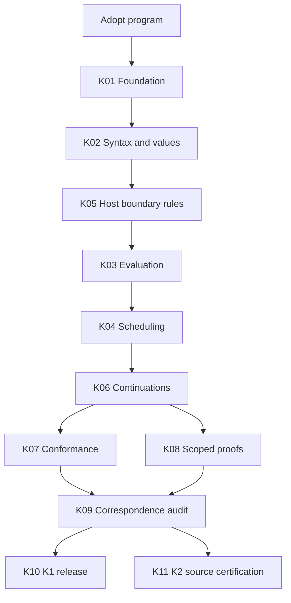

# Full Pel K release: design

## Scope and present evidence

The target is the complete selected Foreman Pel profile, including documented extensions and explicit rejections.
The target is not every interpretation of the Pel paper or a future upstream revision.
The source-bound [audit](../../../docs/guides/pel/k-mapping-audit.json) inventories 56 decisions and 112 paper fixtures.
It also lists 12 AST constructors, 22 builtins, 17 evaluation operations, 18 diagnostic codes, and 20 continuation fields.
The tokenizer contains 13 token kinds. The profile defines eight limits.
These counts describe the baseline inventory. They are not executed K coverage.
The implementation gate must re-extract the current inventory and detect additions, removals, and signature changes.

The existing audit binds 19 sources but does not hash every regression file or transitive dependency.
K01 must extend the implementation manifest to the full dependency and scenario closure.
Keep the original audit as historical evidence until a successor report records actual candidate results.

## Authority and adoption

The profile compatibility decisions and M1 contract constrain both implementations.
M7 supplies inherited semantic requirements. This program supplies decomposition and stronger release acceptance.
On adoption, record one root program owner and one child owner per package in the existing release coverage mechanism.
Validate the register against the actual active inventory before dispatch. New package presence is not automatic program membership.
Reconcile v050 ownership or successor-release dispositions through its existing schema. Do not add an unrecognized disposition or bypass its validator.

Resolve disagreements through a reviewed compatibility decision, not by treating the TypeScript output as the oracle.
If a profile correction changes public behavior, version the profile and rebind all affected evidence.
A claim-domain change requires a reviewed program amendment. No implementation worker may weaken a release gate to obtain a pass.

## Dependency order

K01 freezes the observation contract before any package depends on it.
K02 starts with parser spans and numeric backends because these can invalidate the implementation approach.
K05 supplies configuration-level host rules before K03 needs them.
K03, K04, and K06 then integrate sequentially against that module.
After K06, conformance expansion and proof discharge can proceed independently against the same frozen definition.
K10 CI scaffolding may start after K01. Final release admission waits for K09 and all required evidence.
K11 can investigate a source representation early, but cannot certify a moving runtime.

Each package owns its listed new files. The program owner integrates edits to shared pel.k, manifests, codecs, and build configuration serially.
No child changes production behavior outside its declared scope without a reviewed counterexample and a separately identified correction.

## Architecture

The K modules define syntax, values, environments, control frames, dependency work, counters, diagnostics, host boundaries, and continuation state.
The TypeScript harness supplies data, invokes the pinned tools, validates observations, compares results, and records evidence.
It must not implement a second Pel parser or evaluator.
Independent profile fixtures constrain both engines. Generated cases carry a distinct oracle classification.

Use LLVM for concrete execution and Haskell for scoped proof work.
These backend roles follow the official [K backend lesson](https://kframework.org/k-distribution/k-tutorial/1_basic/20_backends/).
Retain the existing [v7.1.337 starting release](https://github.com/runtimeverification/k/releases/tag/v7.1.337), then pin the complete executable closure.
The [evaluation-order lesson](https://kframework.org/k-distribution/k-tutorial/1_basic/14_evaluation_order/) motivates explicit non-strict control frames.
The [floating-point lesson](https://kframework.org/k-distribution/k-tutorial/2_intermediate/12_floats_and_machine_ints/) supplies numeric primitives, not a proof of JavaScript compatibility.
The [deductive-verification lesson](https://kframework.org/k-distribution/k-tutorial/1_basic/22_proofs/) supplies the proof workflow, not automatic evaluator equivalence.
These primary sources were checked on 2026-09-13. The implementation must retain source revisions in its lock and evidence.

## Proposed K1 release predicates

Every predicate is mandatory. Each has a positive result and an independent refusal control.

| Gate | Required result | Owner |
| --- | --- | --- |
| KG01 | Adopted scope, registered children, complete current source/member/scenario inventory | K01 and program |
| KG02 | Both pinned backends compile and run, closed codecs and scoped runner pass | K01 |
| KG03 | All grammar, numeric, and value cases pass independently | K02 |
| KG04 | All closure, argument, control, and pipe cases pass | K03 |
| KG05 | Both modes, all counters and diagnostics pass exact boundary checks | K04 |
| KG06 | All abstract host schemas, bindings, outputs, and unknown states pass | K05 |
| KG07 | All continuation fields, replay rules, and child accounting pass | K06 |
| KG08 | Complete fixed corpus and release generation tier pass with zero coverage gaps | K07 |
| KG09 | Every mandatory semantic and comparator mutant is behaviorally detected | K07 |
| KG10 | K-P01 through K-P10 discharge with witnesses, controls, and complete trust records | K08 |
| KG11 | Complete runtime relation and host-boundary audit, with no unsupported correctness claims | K09 |
| KG12 | Clean reproduction, enforcing CI, reader checks, artwork, and all applicable publication gates pass | K10 |

K1 requires KG01-KG12 and all original M7 scenarios.
K2 additionally requires all K11 requirements and the complete source-level theorem closure.
K2 is not a hidden prerequisite for K1, and its unchecked tasks do not count as completed K1 work.
A smaller semantic subset may be an explicitly named preview. It cannot be called the K1 full-profile release.

## Effort and staffing assumptions

These are planning estimates, not measured throughput or promised dates.
Assume one experienced K engineer, one TypeScript/tooling engineer, and an independent formal reviewer.
Estimate approximately 21-36 engineer-weeks for K1, with additional review capacity.
A two-person implementation team might need roughly 12-20 calendar weeks, subject to the early feasibility gates.

| Work | Estimated engineer-weeks | Main uncertainty |
| --- | --- | --- |
| K01 | 2-3 | Tool distribution and contract closure |
| K02 | 3-5 | Independent spans, pow, rounding, and backend agreement |
| K03-K04 | 4-6 | Environment graphs and exact reduction charging |
| K05-K06 | 4-6 | Replay and child-state correspondence |
| K07 | 2-4 | Generator quality and useful mutation controls |
| K08 | 3-7 | Inductive invariants and solver support |
| K09-K10 | 3-5 | Independent reproduction and retained release predicates |

Re-estimate after K02 and the first K08 proof vertical slice.
K2 has research-level feasibility risk. Its first source-binding slice receives a separate two-engineer-week investigation budget.
That budget produces an admitted route or a documented unavailable result, not a promised proof.
No calendar commitment for the full K2 theorem follows from a successful slice.

## Risks and responses

Numeric or parser disagreement blocks K02. Preserve the counterexample and resolve the profile or implementation explicitly.
A backend limitation blocks the affected proof. Keep it unknown or unavailable until an admitted route discharges it.
An observation projection that erases a dependent effect must fail its mutation control.
A stale source inventory blocks dispatch and release admission.
A timeout cannot turn into a skip or reduce the case denominator.
A new K dependency must not increase mandatory installed-product dependencies.
Existing host or numbered-release failures remain blockers for claims and releases that depend on them.

## Deferred work

K1 does not prove provider truth, cryptographic collision resistance, kernel isolation, remote cancellation, or the complete Foreman orchestrator.
The host correspondence ledger must expose these assumptions and bind applicable existing tests.
Positive automatic legacy-controller resume and broad TypeScript migration stay with their existing owners.
Repository cleanup and production-code reduction stay in their separately authorized release.

## Scenario path reconciliation

The M7 catalog paths are planned destinations. The child packages group some tests under new suite filenames.
coverage.json records every original T-M7 scenario and its original and canonical planned destinations.
Before implementation dispatch, reconcile the M7 task paths and catalog destinations through a scenario-preserving review.
Preserve each original fixture, action, expected outcome, requirement ID, and evidence obligation.
Do not count path relocation as scenario execution. The original catalog stays unchanged in this planning commit.

## Improvements and measurement

| Intended improvement | K1 acceptance measurement | Baseline |
| --- | --- | --- |
| Remove unmapped language behavior | Every current inventory member has executed distinguishing coverage | Planned mapping only |
| Expose implementation disagreement | Independent fixed expectations, differential corpus, and retained counterexamples | No K execution |
| Detect insensitive tests | Every mandatory semantic and comparator mutant is behaviorally detected | No K mutation results |
| Check recovery invariants | Ten scoped claims with witnesses and admitted proof results | No Pel K proofs |
| Make evidence reproducible | Independent clean reproduction with exact source/tool/result bindings | No K release bundle |

These are quality and evidence targets. No production speedup, token reduction, or provider accuracy improvement is inferred from K adoption.
Measure compile, case, proof, and reproduction costs separately on the pinned host.
